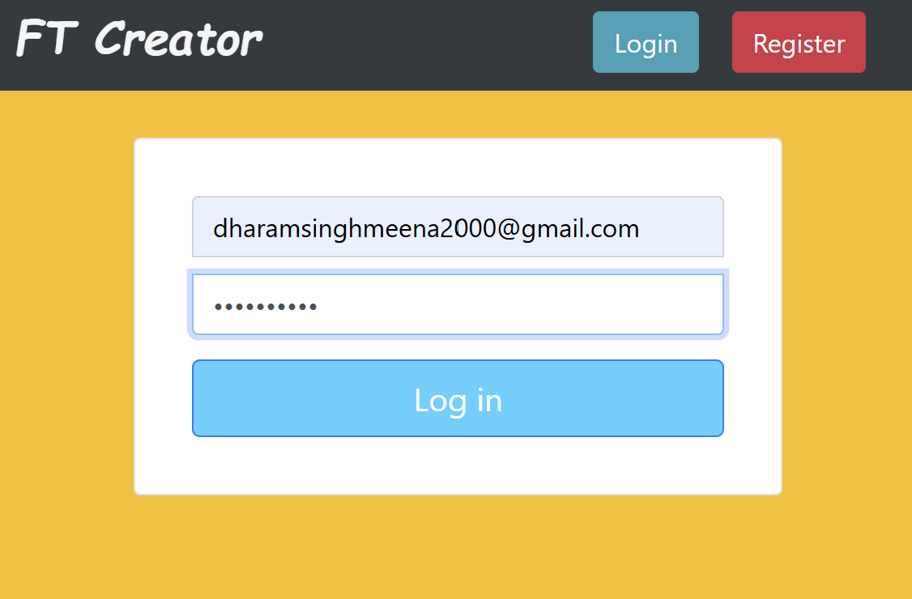

# Family tree creator

This is a web-app to organize and store the names/details of your family members. Can be close or far related.

There is login and Register funcitionalities.

*Fig: Login to your account*

## How to Use

1. To add individual, click on Add individual and fill the form then submit it.
2. To add relation, click on add relation button, fill then form and submit.
3. First make partners spouse, then only add childrens. Otherwise they will not be visible.
4. If cards became invisible, check any left relations.

## Created Using
- Django Framework
- Web Languages: CSS, HTML, JS
- Backend Languages: Python
- Tools: Git
- 3rd Party Library: Balkan FT Library